# 使い方

部屋を用意して、子どもたちが話しているあいだ見守る大人のための手順書。

サーバーを立てる話は [`docs/deploy.md`](./docs/deploy.md)、手元で動かす話は
[`docs/development.md`](./docs/development.md)、仕組みの説明は [`README.md`](./README.md) にある。
ここに書くのは、動いているサーバーがある前提で「当日どう操作するか」だけ。

**1〜6章は最初に通して読む。7章から先は、必要になったときに引く。**
同じ内容は画面の中（`/admin/help`）にもあるので、当日は開いたままにしておける。

画面写真はデモ用のデータで撮ったもの。メールアドレスと名前、部屋の名前、子どもの発言は
すべて説明のために作った架空のもので、実際の運用データではない。

---

## 1. そろえるものは3つ。AIのトークンだけは無くても動く

| | これが無いと | 用意する人 |
|---|---|---|
| 動いているサーバー | 何も始まらない | 立てた人（[`docs/deploy.md`](./docs/deploy.md)） |
| 登録ずみのGoogleアカウント | 管理画面に入れない | 特権管理者（→ 10章） |
| AI Engine のトークン | AIだけが黙る。子ども同士のチャットは動く | サーバーを立てた人 |

AIのトークンが無い状態でも部屋は使える。管理画面の上に
「AI未設定（子ども同士のチャットのみ）」と出ていれば、それが今の状態。

---

## 2. 管理画面に入れるのは、登録されたGoogleアカウントだけ

ブラウザで `/admin` を開く。

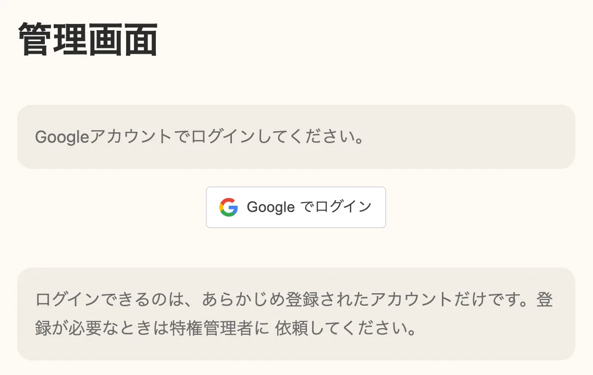

「Google でログイン」しか無い。誰でも入れる画面ではなく、**あらかじめ登録された
Googleアカウントだけ**が通る。登録されていないアカウントでログインすると
「このGoogleアカウントは登録されていません」と出る。自分のアカウントが未登録なら、
特権管理者に頼んで登録してもらう（→ 10章）。

入れると上にこの帯が出る。

「使い方」がこのページの画面版。「特権管理者」のしるしが付いていれば、
他の人が作った部屋も見られるし、アカウントの登録もできる。

ログインの状態は12時間で切れる。子どもが触る端末では開いたままにしない。

---

## 3. 合言葉と有効時間は、作ったあとから変えられない

「部屋を作る」を押すとフォームが開く。

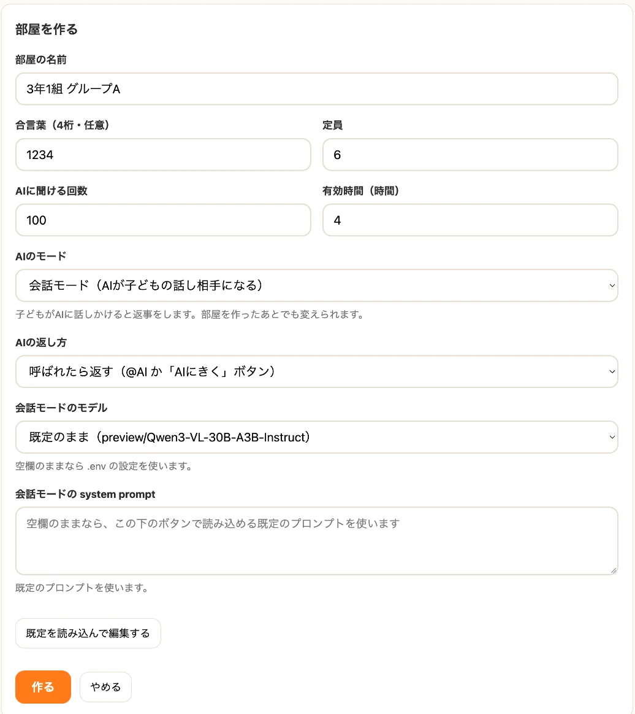

埋める項目は7つ。ほとんどは後から直せるが、**合言葉と有効時間だけは作り直すしかない**ので、
ここで決めきる。

| 項目 | 決め方 | あとから |
|---|---|---|
| 部屋の名前 | 子どもの画面の見出しに出る | 変えられる |
| 合言葉（4桁・任意） | 入室時に聞かれる。人目に触れる場所でコードを配るなら付ける | **変えられない** |
| 定員 | 同時に入れる人数 | 変えられる |
| AIに聞ける回数 | その部屋でAIを呼べる合計。使い切ったら数を上げれば続きから使える | 変えられる |
| 有効時間 | 過ぎると部屋が閉じる | **変えられない**（ただし「4時間 延長」はできる） |
| AIのモード | 会話モードか意見モード（→ 6章） | 変えられる |
| AIの返し方 | 会話モードのときだけ選べる | 変えられる |

いちばん下の「会話モードのモデル」と「system prompt」は空欄のままでいい。
空欄が「既定を使う」の意味になる。ここを触るのは、既定のAIの答え方を変えたくなってからで遅くない。

作った部屋は**作った人のもの**になる。当日その部屋を見る人が、自分でログインして作ること。
他の管理者が作った部屋は一覧に出てこない（特権管理者だけは全部見える）。

---

## 4. 部屋の渡し方は、6桁の番号かURLの2つ

作ると一覧に並ぶ。

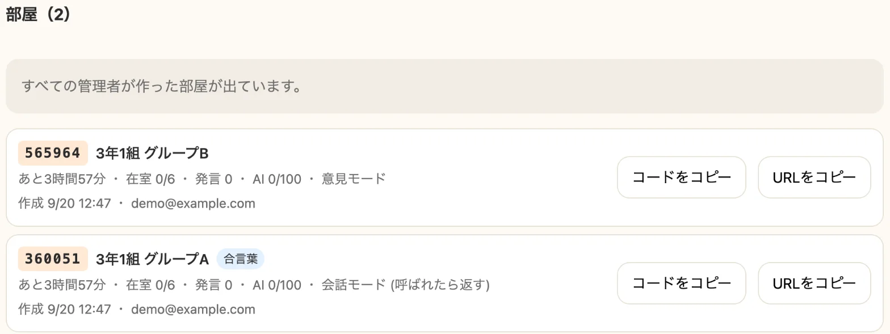

左の6桁が部屋コード。残り時間・在室数・発言数・AIの使用量が1行で分かる。
行をクリックすると下に詳細が開く。

渡し方は場面で選ぶ。**黒板に書く・読み上げるなら6桁**、**QRコードやチャットで送るならURL**。
どちらも同じ部屋に入る。「コードをコピー」は6桁だけ、「URLをコピー」はURL全体を取る。

子ども側はこうなる。トップページ（`/`）で6桁を入れる。

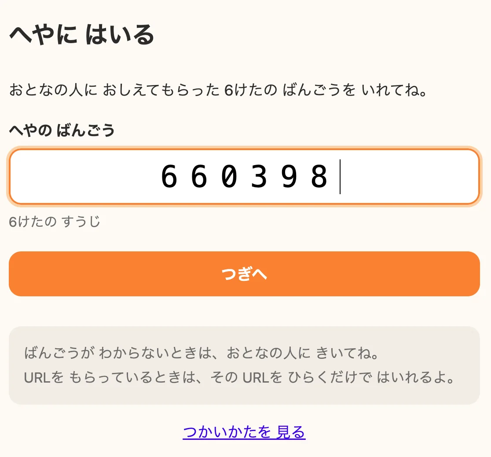

次になまえを入れる。合言葉を付けた部屋なら、ここで4桁も聞かれる。

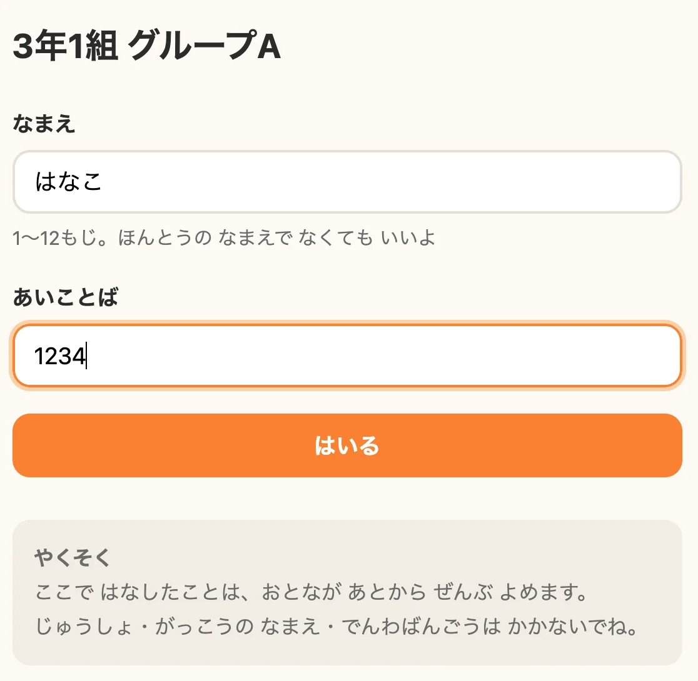

なまえは1〜12文字で、本名でなくてよいと画面にも書いてある。ただし**同じ名前は2人使えない**ので、
同じクラスに同名の子がいるなら、先に決めておくと詰まらない。

---

## 5. 話し手は、発言の頭のマークで見分ける

入るとチャットが始まる。

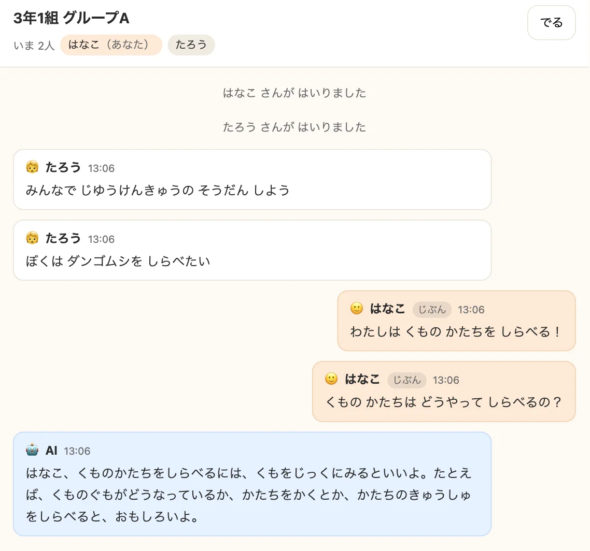

色と位置だけでなく、**発言の頭のマーク**でも誰の発言か分かるようにしてある。
🙂 が自分、🧒 がほかの子、🤖 がAI。上の「いま 2人」は、その時点でページを開いている人数。

入力欄はこの3つ。

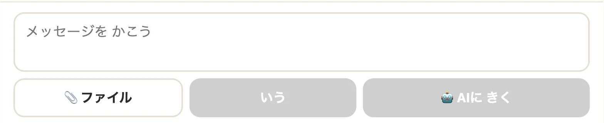

「いう」でみんなに送る。「🤖 AIに きく」を押すと、書いた内容をAIに読ませて返事をもらう。
本文を `@AI` で始めても同じ。「📎 ファイル」は1回に3つまで、1つ10MBまで。
写真（png・jpg・gif・webp）はタイムラインに出て、txt・md・csv・pdf はファイル名が出る。

AIが書いているあいだは「■ とめる」が出る。押すとそこまでの本文を残して終わる。

---

## 6. AIの出方は、部屋ごとに2種類

3章で選んだ「AIのモード」で、子どもの画面のボタンごと入れかわる。
子ども同士のチャットは、どちらのモードでも同じように動く。違うのはAIの出方だけ。

| | 会話モード | 意見モード |
|---|---|---|
| AIの立ち位置 | 部屋の話し相手 | ひとりの参加者。会話には割り込まない |
| 口を開くきっかけ | 「🤖 AIに きく」／`@AI` で始まる発言／「毎回返す」設定 | 「🤖 AIに いけんを きく」だけ |
| 誰に向けて話すか | 呼びかけた子ひとり | 部屋のみんな |
| 向く場面 | 質問する、相手をしてもらう | 話し合いの途中で別の見方を出してもらう |

意見モードの部屋では、入力欄の上にこのボタンが出る。

押すと、そこまでのやり取りを読んだAIが自分の意見を言う。

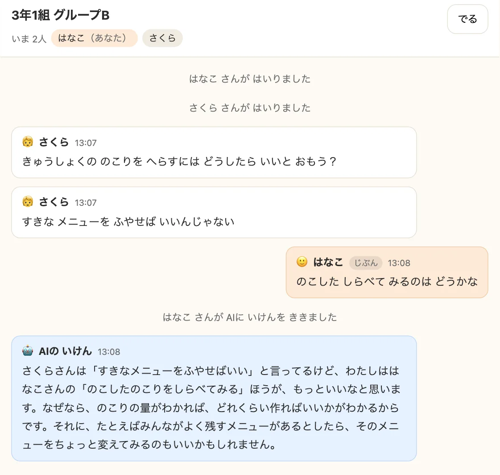

意見の前に「◯◯さんが AIに いけんを ききました」が出る。誰がAIを呼んだかを
部屋の全員に見せるため。AIは名前を出して、誰の意見にどう賛成するか・どう違うかを言う。

会話モードの「AIの返し方」は、既定の**呼ばれたら返す**でたいてい足りる。
**毎回返す**にすると子どもの発言すべてにAIが反応するので、AIに聞ける回数の減りが速い。

---

## 7. 会話のあいだに見るのは、在室とログ

一覧で部屋の行をクリックすると詳細が開く。

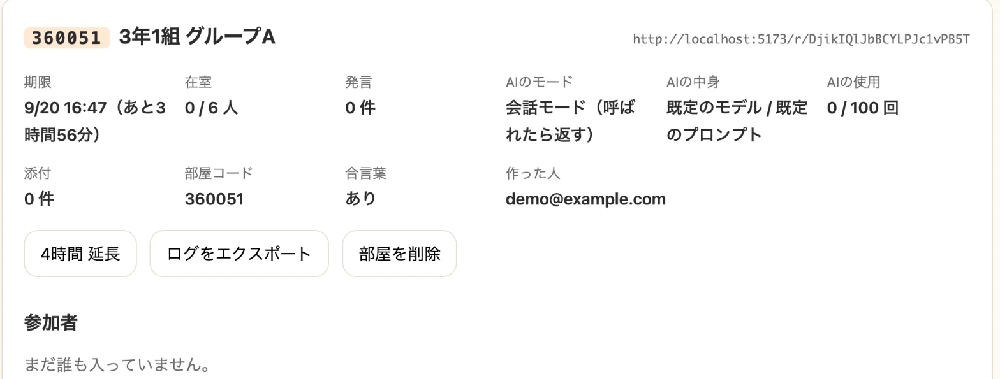

残り時間、在室、発言数、AIの使用量がここに揃う。「4時間 延長」は何度でも押せるので、
盛り上がって時間が足りなくなったらその場で伸ばす。

同じ画面の下に会話ログが出る。直近500件。

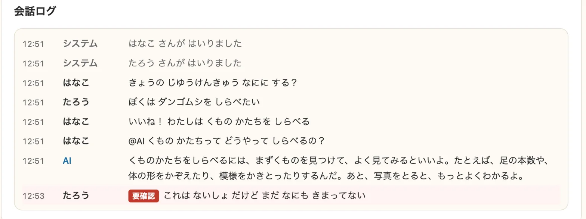

気をつけたい言葉が入っていた行には赤い「要確認」が付き、背景の色も変わる。
この写真は説明のために、当たり障りのない語を気をつけたい言葉として設定して撮ったもの。
実際のリストは別に用意する（[README の「NGワード」](./README.md#ngワード)）。

印が付いた発言も、**止まらずにふつうに部屋へ出る**。AIがその話に触れなくなるだけで、
子どもの画面には何も出ない。印に気づいて声をかけるのは大人の仕事という作りになっている。

いちばん効くのは、大人が同じ部屋に入っていることそのもの。言葉のリストは最後の網ではない。

---

## 8. AIに聞ける回数とモードは、始まってからでも変えられる

詳細の「設定」で、名前・定員・AIに聞ける回数・AIのモード・返し方・モデル・system prompt を変えられる。

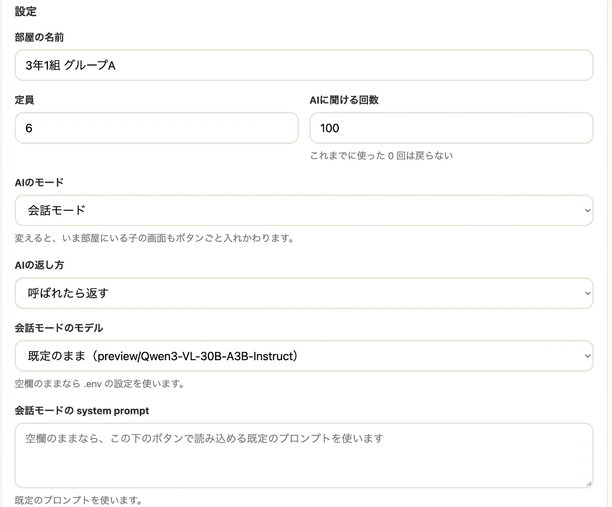

変えたら、いちばん下の「設定を保存」を押す。AIのモードを変えると、いま部屋にいる子の画面も
その場でボタンごと入れかわる。

よく使うのは2つ。AIに聞ける回数が尽きたときに数を上げること、
話し合いの段になってから意見モードに切り替えること。

---

## 9. 終わったら、エクスポートしてから消す

順番を逆にすると戻せない。

1. 詳細の「ログをエクスポート」で、部屋・参加者・全メッセージをJSONで保存する
2. ログに目を通す。「要確認」の付いた行は必ず見る
3. 「部屋を削除」を2回押す

**削除すると添付ファイルは実体ごと消えて戻らない。** 会話そのものはDBに残るが、
写真やファイルを後から見返したいなら、消す前にエクスポートしておく。

部屋を消さずに放っておいても、有効時間が過ぎれば閉じて誰も入れなくなる。
急いで消す必要はない。

---

## 10. 管理者を増やせるのは特権管理者だけ

この節は特権管理者だけに関係する。画面の上のほうに「管理者アカウント」が出ていなければ、
あなたは普通の管理者で、この操作はできない。

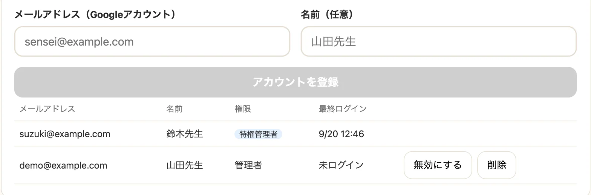

メールアドレス（Googleアカウント）を登録すると、その人がログインできるようになる。
名前は任意。**登録しただけでは安心できない**ので、当日その部屋を見る人には
前日までに一度ログインしてもらう。Googleアカウントの取り違えや、OAuth同意画面の
テストユーザー漏れは、実際にログインするまで表に出ない。

辞める人は「無効にする」。行は残るので後から戻せる。完全に消すなら「削除」を2回。
削除しても、その人が作った部屋は消えない。「所有者なし」の部屋として残り、
以後は特権管理者だけが管理できる。

特権管理者は `.env` の `SUPER_ADMIN_EMAILS` で決まるので、この画面からは無効化も削除もできない。
辞めさせるには先に `.env` から外してサーバーを再起動する。

---

## 11. 困ったとき

上から順に読む章ではなく、当てはまる行だけを拾う。

### 子どもが部屋に入れない → 番号、次に有効時間と定員を見る
打ち間違いがいちばん多い。何度も間違えると「なんども まちがえたみたい」と出て
少し待たされる（総当たりで他人の部屋に当たるのを防ぐため）。
番号が合っているのに入れないなら、有効時間が切れたか、定員が埋まっている。

### 「その なまえは もう つかわれています」→ 同じ部屋に同名の子がいる
一度出た子の名前も残る。少し変えて入り直してもらう。

### 強制退出した子が戻れない → 仕様。別の名前でなら入れる
名前の行を残すので、同じ名前では戻れない。

### AIが黙ったまま → トークン、回数、混雑、NGワードの順に見る
管理画面の上に「AI未設定」と出ていればトークンの問題で、これは当日には直せない。
出ていなければ、その部屋のAIに聞ける回数が尽きたか（詳細の「AIの使用」）、
ほかの子の返事を書いている最中か（生成は部屋に1本まで）、
気をつけたい言葉に当たってAIが触れずにいるか（ログの「要確認」）。

### AIに聞ける回数が尽きた → 設定で数を上げれば続きから使える
使った回数は戻らないので、いまより大きい数を入れる。

### 時間が足りない → 詳細の「4時間 延長」を何度でも押せる

### 作ったはずの部屋が一覧に出ない → 他の管理者が作った部屋は見えない
特権管理者に見てもらうか、自分で作り直す。

### 1人分の画面が急に「入り直して」になる → 同じブラウザで2人入った
同じ部屋に2人目として入ると、1人目の参加情報が上書きされる。
2人分の画面を同時に開くなら、別の端末かシークレットウィンドウを使う。

---

## 12. 言葉の対応表

| 画面の言葉 | 意味 |
|---|---|
| 部屋コード | 部屋ごとの6桁の数字。トップページでこれを入れて入る |
| 合言葉 | 入室時に聞かれる4桁。付けるかどうかは部屋を作るときに決める |
| 会話モード | AIが子どもの話し相手になる部屋 |
| 意見モード | AIがひとりの参加者として意見だけ言う部屋 |
| 呼ばれたら返す / 毎回返す | 会話モードでAIが口を開く条件 |
| system prompt | AIへの指示文。空欄なら既定を使う |
| 要確認 | 気をつけたい言葉が入っていた発言に、ログだけに付く印 |
| 特権管理者 | すべての部屋が見え、アカウントを登録できる管理者 |
| 所有者なし | 作った管理者が削除された部屋。特権管理者だけが管理できる |

---

ここに無いことは [`README.md`](./README.md) に仕様として書いてある。
それでも分からなければ、サーバーを立てた人に聞くのが早い。

最終更新: 2026-09-20
